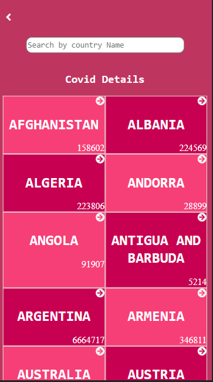
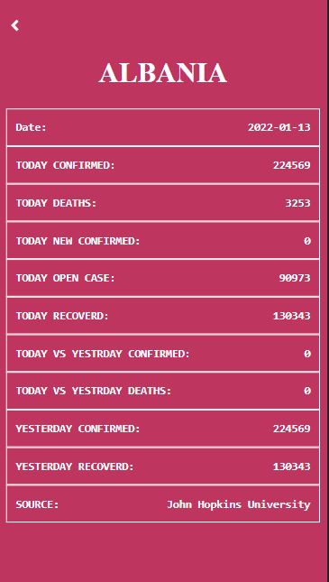

#  MICROVERSE CAPSTONE 3 

> This project was built using react redux to fetch 
> covid data for each country.

Home view                                      |  Information view
:------------------------------------------------:|:-----------------------------------------------:
                     |  


## Built With
- Css
- React 
- React redux
- React test libraries

## Live Link 
[LINK Live]()

## Getting Started

**To get a copy of this repo into your local machine run the following command:**
```
git clone https://github.com/ishimwezachee/Microverse_Capstone3.git
cd Microverse_Capstone3
in visual studio code you can click the go live button to view it live in the browser.
```


👤 **Zachee Ishimwe**

- GitHub: [@ishimwezachee](https://github.com/ishimwezachee)
- Twitter: [@zachee250](https://twitter.com/zachee250)
- LinkedIn: [@zacheeishimwe](https://www.linkedin.com/in/zachee-ishimwe-ab952a119/)


## 🤝 Contributing

Contributions, issues, and feature requests are welcome!

Feel free to check the [issues page](../../issues/).

## Show your support

Give a ⭐️ if you like this project!


## 📝 License

This project is [MIT](./MIT.md) licensed.